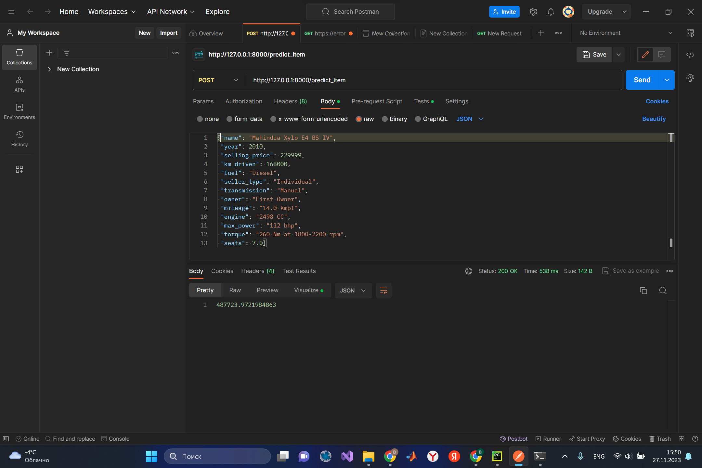
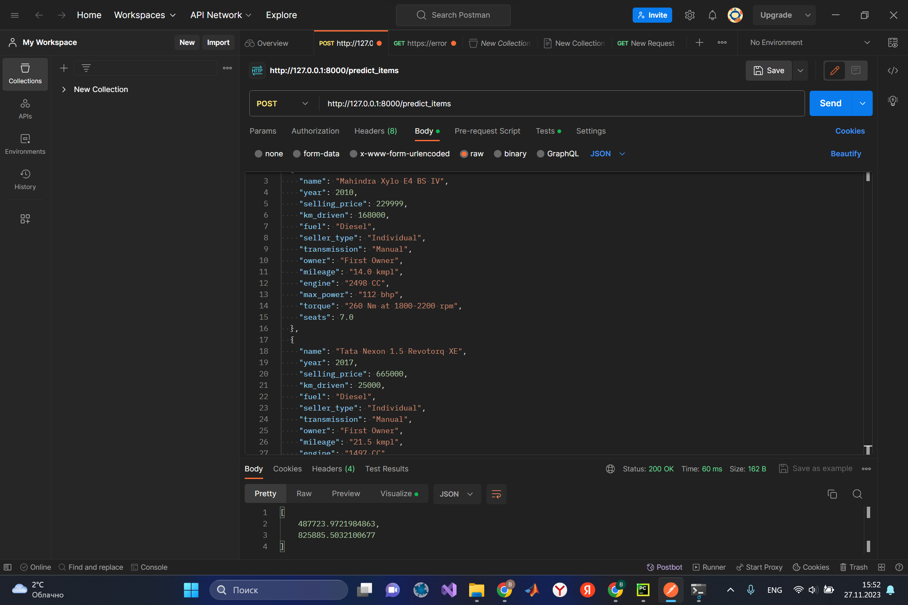
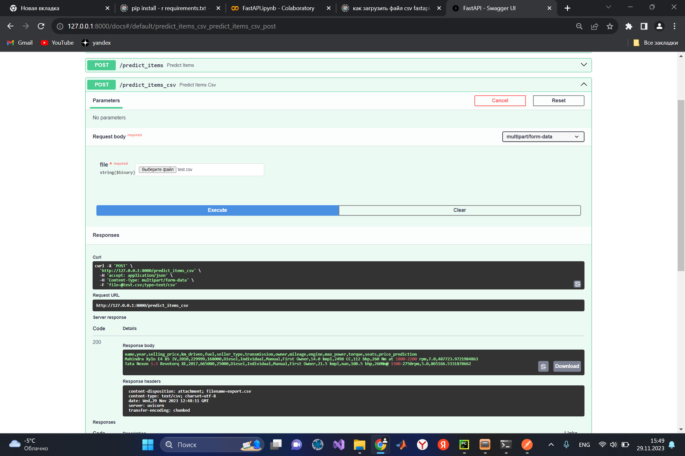

# ML_hw_1
Первое домашнее задание по ML
### Что было сделано
В данной работе был проведён разведочный ананлиз данных, было выяснено какие признаки наиболее сильно влияют на цену автомобиля (это оказались год автомобиля, мощность и объём двигателя), также для предсказания стоимости автомобилей были испробованы различные модели линейной регрессии (с регуляризацией и без), был реализован fastapi сервис для предсказания цен на автомобили. Удалось добиться метрики $R^2$ равной 0.7. Наибольший прирост в качестве предсказаний дало добавление категориальных признаков и новых признаков, составленных из 3 признаков, которые наиболее влияют на цену автомобиля. Наилучший результат был получен с помощью ridge-регрессии.
### Что не удалось сделать
Не получилось спарсить инфу по автомобилям, потому что не нашлось сайта, на котором была бы информация по всем автомобилям (и времени не хватило). Думаю дополнительная информация улучшила бы качество предсказаний.
### Демонстрация работы сервиса

### Что хранится в репозитории:
* description.csv - статистика по трейну для обработки входных данных в сервисе
* main.py - код для сервиса 
* model.pkl - модель для предсказаний
* onehotencoder.pkl - модель для onehot-кодирования
* requirements.txt - необходимые пакеты
* test.csv - датасет для тестирования сервиса
